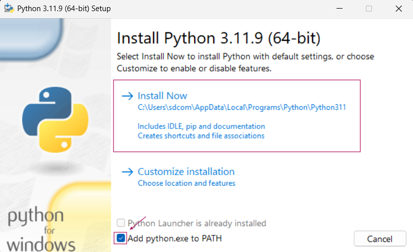

<!-- Improved compatibility of back to top link: See: https://github.com/othneildrew/Best-README-Template/pull/73 -->

<!--
*** Thanks for checking out the Best-README-Template. If you have a suggestion
*** that would make this better, please fork the repo and create a pull request
*** or simply open an issue with the tag "enhancement".
*** Don't forget to give the project a star!
*** Thanks again! Now go create something AMAZING! :D
-->

<!-- PROJECT SHIELDS -->
<!--
*** I'm using markdown "reference style" links for readability.
*** Reference links are enclosed in brackets [ ] instead of parentheses ( ).
*** See the bottom of this document for the declaration of the reference variables
*** for contributors-url, forks-url, etc. This is an optional, concise syntax you may use.
*** https://www.markdownguide.org/basic-syntax/#reference-style-links
-->

<!-- PROJECT LOGO -->
 

  <!--  -->

  <h3 align="center">SaiGO</h3>

  

    A macro for new BIG Game's game, <b>PETS GO!</b> based on <a href="https://www.python.org/">Python</a>.
     
    <a href="https://github.com/steveonly2/SaiGO"><strong>Explore the docs »</strong></a>
     
     
    <a href="https://github.com/steveonly2/SaiGO/issues/new?labels=bug&template=bug-report---.md">Report Bug</a>
    ·
    <a href="https://github.com/steveonly2/SaiGO/issues/new?labels=enhancement&template=feature-request---.md">Request Feature</a>
  

<!-- TABLE OF CONTENTS -->

  
Table of Contents

  <ol>
    <li><a href="#description">Description</li>
    <li><a href="#installation">Installation</a></li>
    <li><a href="#usage">Usage</a></li>
    <li><a href="#credits">Credits</a></li>
    <li><a href="#license">License</a></li>
  </ol>

<!-- Description -->
## Description

<b>SaiGO</b> is a macro for the new game from BIG Games, <b>PETS GO!</b> This is a RNG based game which spins-off from the Pet Simulator series. The macro is based on <a href="https://www.python.org/">Python</a>, which allowed us to do much more than AutoHotkey. This allowed us to modernize the GUI and improve reliability of the macro. SaiGO is still in it's early stages, expect some bugs and upcoming changes soon.

(<a href="#readme-top">back to top</a>)

<!-- INSTALLATION -->
## Installation

This macro is based on a programming language called <a href="https://www.python.org/">Python</a>. If you haven't already, you need to install the latest Python version from <a href="https://www.python.org/downloads/">here</a>. Make sure you `add python.exe to PATH` and then press `Install Now`, as shown here. 

 

After you've installed Python. You now can download this macro from <a href="https://github.com/steveonly2/SaiGO/releases">here</a>. Make sure you downloaded `SaiGO.zip` if you wanted the macro, _but if you're a developer who wants to modify the macro, make sure to download `Source Code` instead._

After you downloaded, you should extract `SaiGO.zip` to a folder. In that folder you'll find `SaiGO.py`, `LICENSE.txt` and `install.bat`.

To use the macro, you needed to run `install.bat` to install dependencies required for the macro. This file will delete itself and log the actions in `log.txt`. If you haven't downloaded Python yet, it will not delete itself and suggest you to download Python. Once again, if you haven't install it yet, follow the <a href="#installation">guide</a> above.

After everything, you can run `SaiGO.py` to start using the macro.

(<a href="#readme-top">back to top</a>)

<!-- USAGE EXAMPLES -->
## Usage

At the moment, features are still limited. But, currently, SaiGO has a Dark Mode GUI and AutoClicker, which supports all resolutions. You can toggle them in the `Settings` tab.

To use the macro, you can click `F1 START` to start the macro, and to stop it, you can click `F2 STOP`. Alternatively, you can press `F1` and `F2` on your keyboard to start and stop the macro.

(<a href="#readme-top">back to top</a>)

<!-- Credits -->
## Credits

<b>SaiGO</b> created by steveonly4 and innocenthuman.

Programming Language: <a href="https://www.python.org/">Python</a>

README.md template from <a href="https://github.com/othneildrew/Best-README-Template/tree/main">Best README Template</a>

<!-- LICENSE -->
## License

Distributed under the GPL-3.0 License. See `LICENSE.txt` for more information.

(<a href="#readme-top">back to top</a>)

